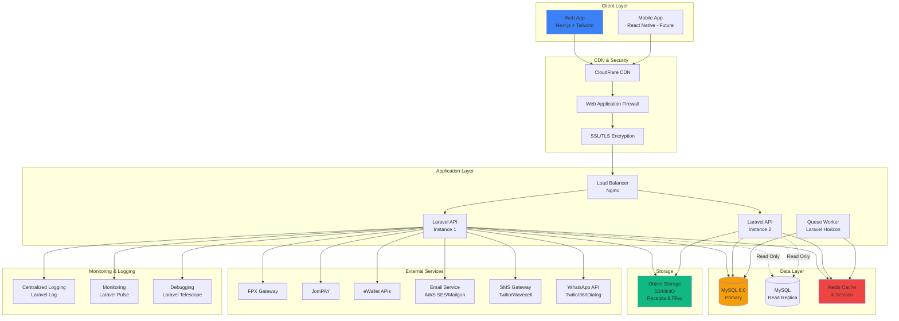
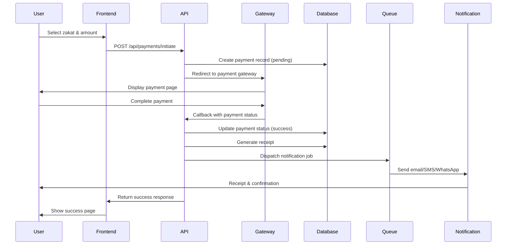
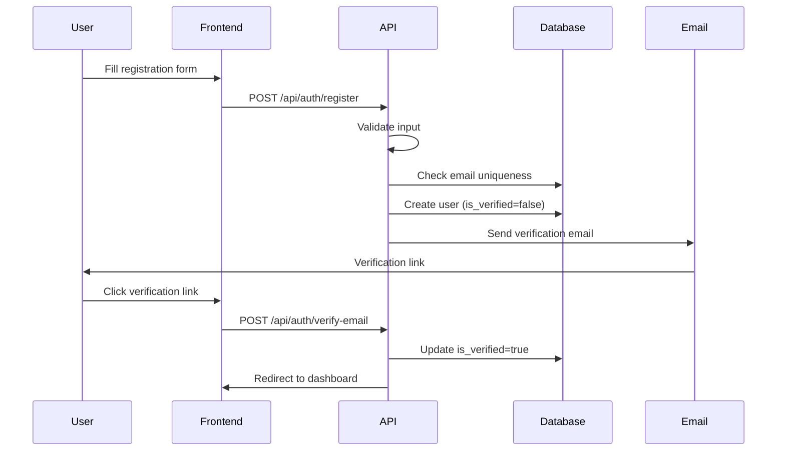

# 🏗️ System Architecture Documentation

> **Zakat Selangor - Complete System Design**  
> Author: Faiz Nasir  
> Version: 1.0.0  
> Date: October 29, 2025

---

## 📑 Table of Contents

- [System Overview](#system-overview)
- [Architecture Diagram](#architecture-diagram)
- [System Modules](#system-modules)
- [Technology Stack](#technology-stack)
- [Data Flow](#data-flow)
- [Integration Points](#integration-points)
- [Scalability & Performance](#scalability--performance)

---

## 🎯 System Overview

### Vision
Mewujudkan platform digital end-to-end yang memudahkan kutipan zakat dengan ketelusan, keselamatan, dan kecekapan tinggi untuk Lembaga Zakat Selangor.

### Core Objectives

| Objective | Description | Target Metrics |
|-----------|-------------|----------------|
| **User Experience** | Proses pembayaran yang mudah dan pantas | <3 minutes per transaction |
| **Reliability** | System uptime dan data integrity | 99.9% uptime |
| **Security** | Perlindungan data dan transaksi | PCI-DSS compliant |
| **Performance** | Response time yang cepat | <200ms API response |
| **Scalability** | Sokongan untuk pertumbuhan pengguna | 100,000+ concurrent users |
| **Compliance** | Pematuhan Syariah dan audit | 100% audit trail |

### System Characteristics

- **Type**: Web-based application (SaaS model)
- **Architecture**: Microservices-ready monolith (modular Laravel)
- **Deployment**: Dockerized containers
- **Hosting**: Cloud-based (AWS/Azure compatible)
- **Users**: Pembayar (Individual & Corporate), Amil, Admin

---

## 🏛️ Architecture Diagram

### High-Level Architecture



### Three-Tier Architecture

```
┌─────────────────────────────────────────────────────────┐
│                   PRESENTATION LAYER                     │
│  • Next.js 14 (App Router)                              │
│  • Tailwind CSS + Shadcn/ui                             │
│  • React Query (State Management)                        │
│  • Server-Side Rendering (SSR)                          │
└─────────────────────────────────────────────────────────┘
                           ↓ HTTPS/REST API
┌─────────────────────────────────────────────────────────┐
│                   APPLICATION LAYER                      │
│  • Laravel 11 (PHP 8.2+)                                │
│  • RESTful API                                          │
│  • Business Logic & Services                            │
│  • Authentication (Sanctum)                             │
│  • Queue Processing (Horizon)                           │
└─────────────────────────────────────────────────────────┘
                           ↓ SQL/Cache
┌─────────────────────────────────────────────────────────┐
│                      DATA LAYER                          │
│  • MySQL 8.0 (Primary + Replica)                        │
│  • Redis (Cache + Session + Queue)                      │
│  • Object Storage (S3/MinIO)                            │
└─────────────────────────────────────────────────────────┘
```

---

## 🧩 System Modules

### A. Modul Pendaftaran & Profil Pembayar

**Purpose**: Pengurusan akaun dan profil pembayar

**Features**:
- ✅ Pendaftaran individu dengan MyKad
- ✅ Pendaftaran syarikat dengan SSM
- ✅ Email & SMS verification
- ✅ Profile management
- ✅ Password reset & 2FA
- ✅ Sejarah bayaran lengkap

**API Endpoints**:
```
POST   /api/auth/register
POST   /api/auth/login
POST   /api/auth/verify-email
GET    /api/users/profile
PUT    /api/users/profile
GET    /api/users/payment-history
```

**Database Tables**: `users`, `notifications`

---

### B. Modul Pengiraan Zakat

**Purpose**: Kalkulator zakat interaktif untuk pelbagai jenis zakat

**Features**:
- ✅ Zakat Pendapatan (salary calculator)
- ✅ Zakat Perniagaan (business assets)
- ✅ Zakat Emas & Perak (gold/silver)
- ✅ Zakat Simpanan (savings)
- ✅ Zakat Saham & Takaful
- ✅ Auto-calculate nisab & haul
- ✅ Save calculation history

**Calculation Formula**:
```
Zakat Due = (Gross Amount - Deductions) × Rate
Where:
  - Rate = 2.5% (0.025)
  - Nisab = RM 14,624 (85g gold equivalent)
  - Haul = 355 days (Islamic lunar year)
```

**API Endpoints**:
```
GET    /api/zakat-types
POST   /api/zakat/calculate
GET    /api/zakat/calculations
GET    /api/zakat/calculations/{id}
```

**Database Tables**: `zakat_types`, `zakat_calculations`

---

### C. Modul Kutipan & Pembayaran

**Purpose**: Pemprosesan pembayaran melalui pelbagai gateway

**Features**:
- ✅ Multi-gateway support (FPX, JomPAY, eWallet)
- ✅ Secure payment processing
- ✅ Real-time payment status
- ✅ Auto-retry for failed payments
- ✅ Refund processing
- ✅ Payment reconciliation

**Payment Flow**:
```
1. User selects zakat type & amount
2. Choose payment method
3. Redirect to payment gateway
4. Gateway processes payment
5. Callback to system
6. Update payment status
7. Generate receipt
8. Send notification
```

**API Endpoints**:
```
POST   /api/payments/initiate
POST   /api/payments/callback/{gateway}
GET    /api/payments/{ref_no}
POST   /api/payments/{id}/refund
GET    /api/receipts/{receipt_no}
```

**Database Tables**: `payments`, `receipts`, `audit_logs`

**Payment Gateway Integration**:
| Gateway | Type | Methods | Fees |
|---------|------|---------|------|
| **FPX** | Bank transfer | Online banking | RM 1.00 flat |
| **JomPAY** | Bill payment | JomPAY code | RM 0.50 |
| **eWallet** | Digital wallet | TnG, MAE, ShopeePay | 1.5% |
| **iPay88** | Aggregator | Card, FPX, eWallet | 2.5% |

---

### D. Modul Ejen / Amil Digital

**Purpose**: Pengurusan amil dan komisyen

**Features**:
- ✅ Amil registration & verification
- ✅ Kutipan atas nama amil
- ✅ GPS tracking untuk audit
- ✅ Commission auto-calculation
- ✅ Commission payment tracking
- ✅ Performance dashboard

**Commission Structure**:
```
Default Rate: 2% of payment amount
Example:
  Payment: RM 1,000
  Commission: RM 20 (2%)
```

**API Endpoints**:
```
GET    /api/amil/dashboard
GET    /api/amil/collections
GET    /api/amil/commissions
POST   /api/amil/collect-payment
GET    /api/admin/amil-performance
```

**Database Tables**: `users` (role: amil), `payments`, `amil_commissions`

---

### E. Modul Pemantauan & Laporan

**Purpose**: Dashboard dan reporting untuk pentadbir

**Features**:
- ✅ Real-time dashboard
- ✅ Daily/Monthly/Yearly reports
- ✅ Payment analytics
- ✅ Amil performance tracking
- ✅ Collection by branch/district
- ✅ Export to PDF/Excel
- ✅ Custom date range reports

**Dashboard Metrics**:
```
📊 Today's Collection
📈 Monthly Trends
👥 Active Payers
💰 Top Zakat Types
🏆 Top Performing Amil
📍 Collection by Branch
```

**API Endpoints**:
```
GET    /api/reports/dashboard
GET    /api/reports/daily-summary
GET    /api/reports/monthly-summary
GET    /api/reports/amil-performance
GET    /api/reports/export/{type}
```

**Database Tables**: All tables + Views (`v_daily_payment_summary`, `v_amil_performance`)

---

### F. Modul Audit & Syariah Compliance

**Purpose**: Audit trail dan pematuhan Syariah

**Features**:
- ✅ Complete audit trail
- ✅ Change tracking (before/after)
- ✅ User action logging
- ✅ IP & browser tracking
- ✅ Export audit reports
- ✅ Syariah compliance reports

**Logged Actions**:
```
✓ User registration/login
✓ Payment creation/update
✓ Profile changes
✓ Admin actions
✓ Receipt generation
✓ Commission payments
```

**API Endpoints**:
```
GET    /api/audit-logs
GET    /api/audit-logs/user/{user_id}
GET    /api/audit-logs/table/{table_name}
GET    /api/audit-logs/export
```

**Database Tables**: `audit_logs`

---

### G. Modul Komunikasi & Pengingat

**Purpose**: Notifikasi automatik kepada pengguna

**Features**:
- ✅ WhatsApp notifications
- ✅ Email notifications
- ✅ SMS notifications
- ✅ In-app notifications
- ✅ Scheduled reminders
- ✅ Template management

**Notification Types**:
| Type | Trigger | Channel |
|------|---------|---------|
| **Payment Success** | Payment completed | Email, WhatsApp, SMS |
| **Receipt Generated** | Receipt created | Email (with PDF) |
| **Haul Reminder** | 30 days before haul | WhatsApp, Email |
| **Commission Paid** | Amil commission processed | Email, SMS |
| **Password Reset** | User requests reset | Email |
| **Ramadan Campaign** | Scheduled broadcast | All channels |

**API Endpoints**:
```
GET    /api/notifications
POST   /api/notifications/mark-read/{id}
POST   /api/notifications/send-test
POST   /api/admin/notifications/broadcast
```

**Database Tables**: `notifications`

---

## 🛠 Technology Stack

### Frontend (Presentation Layer)

```yaml
Framework: Next.js 14+
  - App Router (Server Components)
  - Server-Side Rendering (SSR)
  - Static Site Generation (SSG)
  - API Routes

Styling: Tailwind CSS 3+
  - Utility-first CSS
  - Responsive design
  - Dark mode support

UI Components: Shadcn/ui
  - Accessible components
  - Customizable
  - TypeScript support

State Management:
  - React Query (server state)
  - Zustand (client state)

Form Handling:
  - React Hook Form
  - Zod validation

Charts & Visualization:
  - Recharts
  - Chart.js

Additional Libraries:
  - date-fns (date manipulation)
  - clsx/cn (class names)
  - axios (HTTP client)
```

### Backend (Application Layer)

```yaml
Framework: Laravel 11+
  - PHP 8.2+
  - Eloquent ORM
  - Artisan CLI

API: RESTful
  - Laravel Sanctum (auth)
  - API Resources
  - Rate limiting
  - CORS support

Queue & Jobs:
  - Laravel Horizon (Redis queue)
  - Job batching
  - Failed job handling

Caching:
  - Redis cache driver
  - Database query caching
  - Response caching

File Storage:
  - Laravel filesystem
  - S3-compatible driver
  - Local (development)

Testing:
  - PHPUnit
  - Pest PHP
  - Laravel Dusk (E2E)

Additional Packages:
  - Laravel Telescope (debugging)
  - Laravel Pulse (monitoring)
  - Spatie packages (permissions, backup)
```

### Database & Storage

```yaml
Primary Database:
  - MySQL 8.0+
  - InnoDB engine
  - UTF8MB4 charset

Caching & Queue:
  - Redis 7+
  - Persistence enabled
  - Cluster mode (production)

Object Storage:
  - AWS S3 / MinIO
  - Receipt PDFs
  - User uploads

Backup:
  - Automated daily backups
  - 30-day retention
  - Point-in-time recovery
```

### DevOps & Infrastructure

```yaml
Containerization:
  - Docker
  - Docker Compose
  - Multi-stage builds

Web Server:
  - Nginx (reverse proxy)
  - PHP-FPM

CI/CD:
  - GitHub Actions
  - Automated testing
  - Deployment pipelines

Monitoring:
  - Laravel Pulse
  - Server monitoring
  - Uptime monitoring

Logging:
  - Laravel Log
  - Daily rotation
  - Error tracking (Sentry optional)
```

---

## 🔄 Data Flow

### Payment Processing Flow



### User Registration Flow



---

## 🔌 Integration Points

### Payment Gateways

**FPX Integration**
```
Endpoint: https://www.mepsfpx.com.my
Method: POST (Form submission)
Security: SHA256 signature
Callback: POST /api/payments/callback/fpx
```

**JomPAY Integration**
```
Method: Biller code assignment
Ref 1: User ID
Ref 2: Payment reference
Callback: Automated reconciliation
```

**eWallet Integration**
```
Providers: Touch 'n Go, MAE, ShopeePay
Method: REST API
Security: HMAC signature
Callback: Webhook
```

### External Services

**Email Service (AWS SES / Mailgun)**
```yaml
Purpose: Transactional emails
Usage:
  - Receipt delivery
  - Verification emails
  - Password reset
  - Notifications
```

**SMS Gateway (Twilio / Wavecell)**
```yaml
Purpose: SMS notifications
Usage:
  - OTP verification
  - Payment confirmation
  - Haul reminders
```

**WhatsApp API (Twilio / 360Dialog)**
```yaml
Purpose: WhatsApp notifications
Usage:
  - Receipt delivery (PDF)
  - Payment updates
  - Campaign messages
```

---

## ⚡ Scalability & Performance

### Performance Targets

| Metric | Target | Current |
|--------|--------|---------|
| **API Response Time** | <200ms | TBD |
| **Page Load Time** | <2s | TBD |
| **Database Queries** | <50ms | TBD |
| **Concurrent Users** | 10,000+ | TBD |
| **Transactions/sec** | 100+ | TBD |

### Optimization Strategies

**1. Database Optimization**
```
✅ Strategic indexing
✅ Query optimization
✅ Read replicas for reports
✅ Connection pooling
✅ Table partitioning (future)
```

**2. Caching Strategy**
```
✅ Redis for session & cache
✅ Database query caching
✅ API response caching
✅ Static asset caching (CDN)
✅ Browser caching headers
```

**3. Code Optimization**
```
✅ Lazy loading
✅ Code splitting (Next.js)
✅ Image optimization
✅ Minification & compression
✅ Database eager loading
```

**4. Infrastructure**
```
✅ Load balancing
✅ Horizontal scaling
✅ CDN for static assets
✅ Auto-scaling (cloud)
```

### Scaling Roadmap

**Phase 1: Launch (0-10K users)**
- Single application server
- Single database server
- Redis cache

**Phase 2: Growth (10K-50K users)**
- Multiple application servers
- Database read replica
- Load balancer

**Phase 3: Scale (50K-100K users)**
- Auto-scaling groups
- Database sharding
- CDN integration

**Phase 4: Enterprise (100K+ users)**
- Microservices architecture
- Multi-region deployment
- Advanced caching strategies

---

## 🔐 Security Architecture

### Security Layers

```
Layer 1: Network Security
  - CloudFlare WAF
  - DDoS protection
  - IP whitelisting (admin)

Layer 2: Application Security
  - HTTPS/TLS encryption
  - CSRF protection
  - XSS prevention
  - SQL injection prevention
  - Rate limiting

Layer 3: Authentication & Authorization
  - JWT tokens (Sanctum)
  - Password hashing (bcrypt)
  - 2FA (optional)
  - Role-based access control

Layer 4: Data Security
  - Sensitive data encryption
  - PCI-DSS compliance
  - PDPA compliance
  - Regular security audits

Layer 5: Monitoring & Logging
  - Audit trail
  - Security event logging
  - Intrusion detection
```

---

## 📊 System Metrics & KPIs

### Business Metrics
- Total collection (daily/monthly/yearly)
- Number of transactions
- Average transaction value
- Payment success rate
- Amil performance

### Technical Metrics
- System uptime
- API response time
- Error rate
- Database query time
- Cache hit rate

### User Metrics
- Active users
- Registration conversion
- Payment completion rate
- User satisfaction (NPS)

---

**Document Version**: 1.0.0  
**Last Updated**: October 29, 2025  
**Author**: Faiz Nasir  

