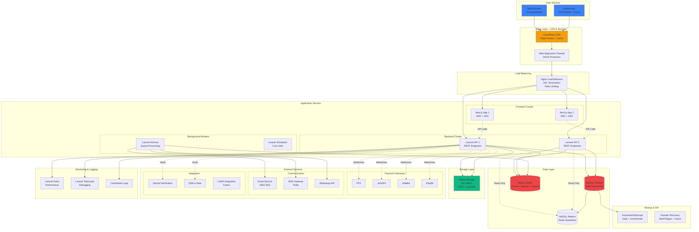
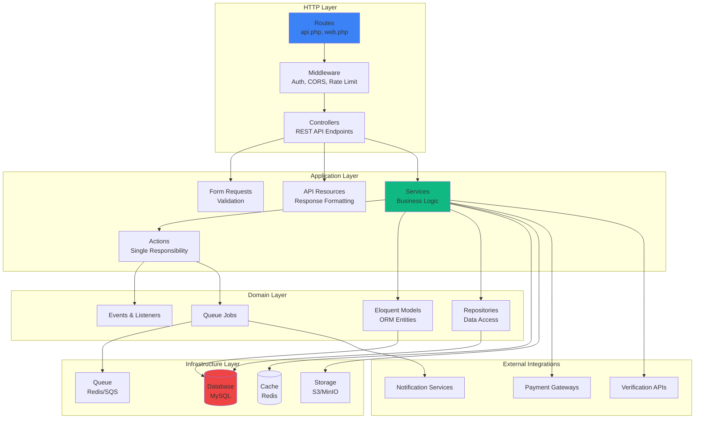
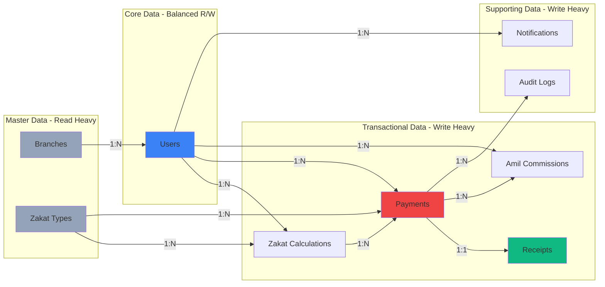
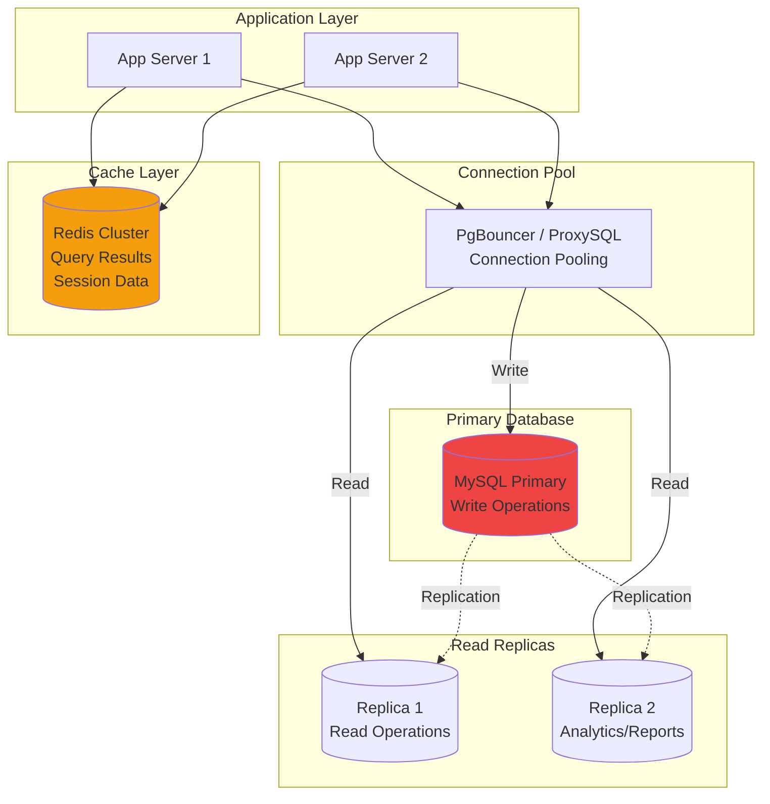
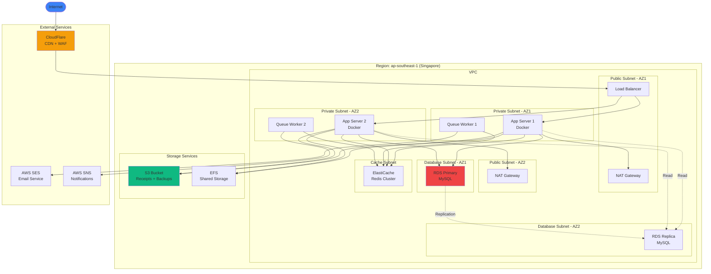
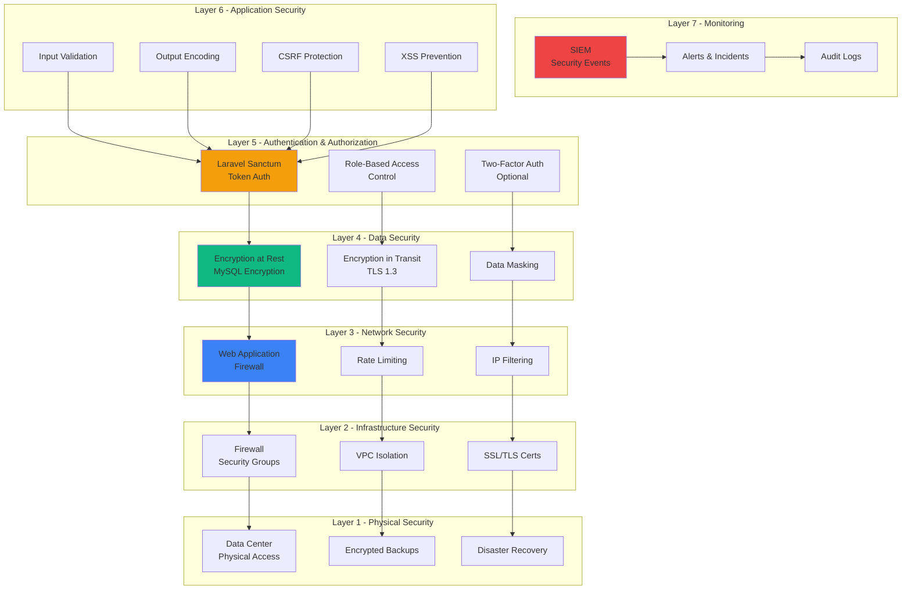
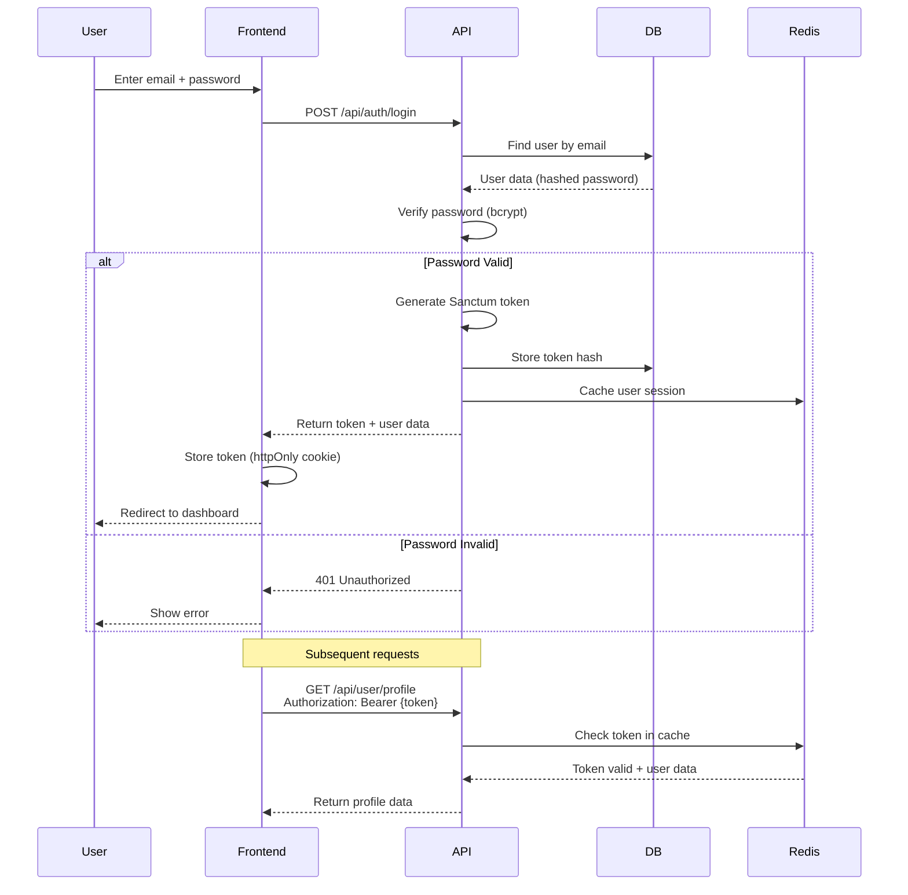

# 🏗️ Architecture Diagrams

> **Zakat Selangor - Visual Architecture Documentation**  
> Author: Faiz Nasir  
> Version: 1.0.0

---

## 📑 Table of Contents

- [Complete System Architecture](#complete-system-architecture)
- [Frontend Architecture](#frontend-architecture)
- [Backend Architecture](#backend-architecture)
- [Database Architecture](#database-architecture)
- [Infrastructure Architecture](#infrastructure-architecture)
- [Security Architecture](#security-architecture)

---

## 🌐 Complete System Architecture

### Full Stack Overview



---

## 💻 Frontend Architecture

### Next.js Application Structure

```mermaid
graph TB
    subgraph "Next.js App Router"
        direction TB
        
        APP[app/<br/>Root Layout]
        
        subgraph "Public Pages"
            HOME[/home<br/>Landing Page]
            LOGIN[/auth/login<br/>Login Page]
            REGISTER[/auth/register<br/>Register Page]
            CALC[/calculator<br/>Zakat Calculator]
        end
        
        subgraph "Protected Pages - Payer"
            DASH[/dashboard<br/>User Dashboard]
            PROFILE[/profile<br/>User Profile]
            HISTORY[/payments<br/>Payment History]
            PAYMENT[/pay<br/>Payment Page]
        end
        
        subgraph "Protected Pages - Amil"
            AMIL_DASH[/amil/dashboard<br/>Amil Dashboard]
            COLLECT[/amil/collect<br/>Collection Form]
            COMMISSION[/amil/commissions<br/>Commission Tracking]
        end
        
        subgraph "Protected Pages - Admin"
            ADMIN_DASH[/admin/dashboard<br/>Admin Dashboard]
            REPORTS[/admin/reports<br/>Reports & Analytics]
            USERS[/admin/users<br/>User Management]
        end
    end
    
    subgraph "Shared Components"
        LAYOUT[Layout Components<br/>Header, Footer, Sidebar]
        UI[UI Components<br/>Shadcn/ui + Custom]
        FORMS[Form Components<br/>React Hook Form]
        CHARTS[Charts & Graphs<br/>Recharts]
    end
    
    subgraph "State Management"
        QUERY[React Query<br/>Server State<br/>API Caching]
        ZUSTAND[Zustand<br/>Client State<br/>UI State]
    end
    
    subgraph "API Client"
        AXIOS[Axios Instance<br/>HTTP Client<br/>Interceptors]
        AUTH[Auth Service<br/>Token Management]
    end
    
    subgraph "Utilities"
        HELPERS[Helper Functions<br/>Formatters, Validators]
        HOOKS[Custom Hooks<br/>useAuth, useUser, etc.]
        CONSTANTS[Constants & Configs]
    end
    
    APP --> HOME
    APP --> LOGIN
    APP --> REGISTER
    APP --> CALC
    APP --> DASH
    APP --> PROFILE
    APP --> HISTORY
    APP --> PAYMENT
    APP --> AMIL_DASH
    APP --> COLLECT
    APP --> COMMISSION
    APP --> ADMIN_DASH
    APP --> REPORTS
    APP --> USERS
    
    HOME --> LAYOUT
    DASH --> UI
    PAYMENT --> FORMS
    REPORTS --> CHARTS
    
    DASH --> QUERY
    PROFILE --> ZUSTAND
    
    QUERY --> AXIOS
    AXIOS --> AUTH
    
    FORMS --> HELPERS
    UI --> HOOKS
    
    style APP fill:#3b82f6
    style QUERY fill:#10b981
    style AXIOS fill:#f59e0b
```

### Component Hierarchy

```
app/
├── layout.tsx (Root Layout)
├── page.tsx (Home Page)
├── (auth)/
│   ├── login/
│   │   └── page.tsx
│   └── register/
│       └── page.tsx
├── (payer)/
│   ├── dashboard/
│   ├── profile/
│   ├── payments/
│   └── pay/
├── (amil)/
│   ├── dashboard/
│   ├── collect/
│   └── commissions/
└── (admin)/
    ├── dashboard/
    ├── reports/
    └── users/

components/
├── layout/
│   ├── Header.tsx
│   ├── Footer.tsx
│   └── Sidebar.tsx
├── ui/ (Shadcn/ui)
│   ├── button.tsx
│   ├── input.tsx
│   ├── card.tsx
│   └── ...
├── forms/
│   ├── LoginForm.tsx
│   ├── RegisterForm.tsx
│   └── PaymentForm.tsx
└── charts/
    ├── PaymentChart.tsx
    └── AmilChart.tsx

lib/
├── api/
│   ├── axios.ts
│   ├── auth.ts
│   └── endpoints/
├── hooks/
│   ├── useAuth.ts
│   ├── useUser.ts
│   └── usePayments.ts
├── store/
│   └── useStore.ts (Zustand)
└── utils/
    ├── formatters.ts
    ├── validators.ts
    └── constants.ts
```

---

## ⚙️ Backend Architecture

### Laravel Application Layers



### Laravel Directory Structure

```
backend/
├── app/
│   ├── Http/
│   │   ├── Controllers/
│   │   │   ├── AuthController.php
│   │   │   ├── PaymentController.php
│   │   │   ├── ZakatController.php
│   │   │   └── Admin/
│   │   ├── Middleware/
│   │   │   ├── RoleMiddleware.php
│   │   │   └── CheckVerified.php
│   │   ├── Requests/
│   │   │   ├── RegisterRequest.php
│   │   │   ├── PaymentRequest.php
│   │   │   └── CalculationRequest.php
│   │   └── Resources/
│   │       ├── UserResource.php
│   │       ├── PaymentResource.php
│   │       └── ReceiptResource.php
│   ├── Models/
│   │   ├── User.php
│   │   ├── Payment.php
│   │   ├── ZakatCalculation.php
│   │   ├── Receipt.php
│   │   └── AuditLog.php
│   ├── Services/
│   │   ├── ZakatService.php
│   │   ├── PaymentService.php
│   │   ├── ReceiptService.php
│   │   └── NotificationService.php
│   ├── Actions/
│   │   ├── CreatePayment.php
│   │   ├── GenerateReceipt.php
│   │   └── CalculateZakat.php
│   ├── Jobs/
│   │   ├── SendEmailJob.php
│   │   ├── GenerateReceiptPDF.php
│   │   └── ProcessPaymentCallback.php
│   ├── Events/
│   │   ├── PaymentSuccessful.php
│   │   └── UserRegistered.php
│   ├── Listeners/
│   │   ├── SendPaymentNotification.php
│   │   └── GenerateReceipt.php
│   └── Repositories/
│       ├── PaymentRepository.php
│       └── UserRepository.php
├── database/
│   ├── migrations/
│   ├── seeders/
│   └── factories/
├── routes/
│   ├── api.php
│   └── web.php
└── config/
    ├── services.php
    ├── payment.php
    └── zakat.php
```

---

## 🗄️ Database Architecture

### Data Flow & Relationships



### Database Scaling Strategy



---

## 🏗️ Infrastructure Architecture

### Cloud Infrastructure (AWS Example)



---

## 🔒 Security Architecture

### Security Layers & Controls



### Authentication Flow



---

**Document Version**: 1.0.0  
**Last Updated**: October 29, 2025  
**Author**: Faiz Nasir

