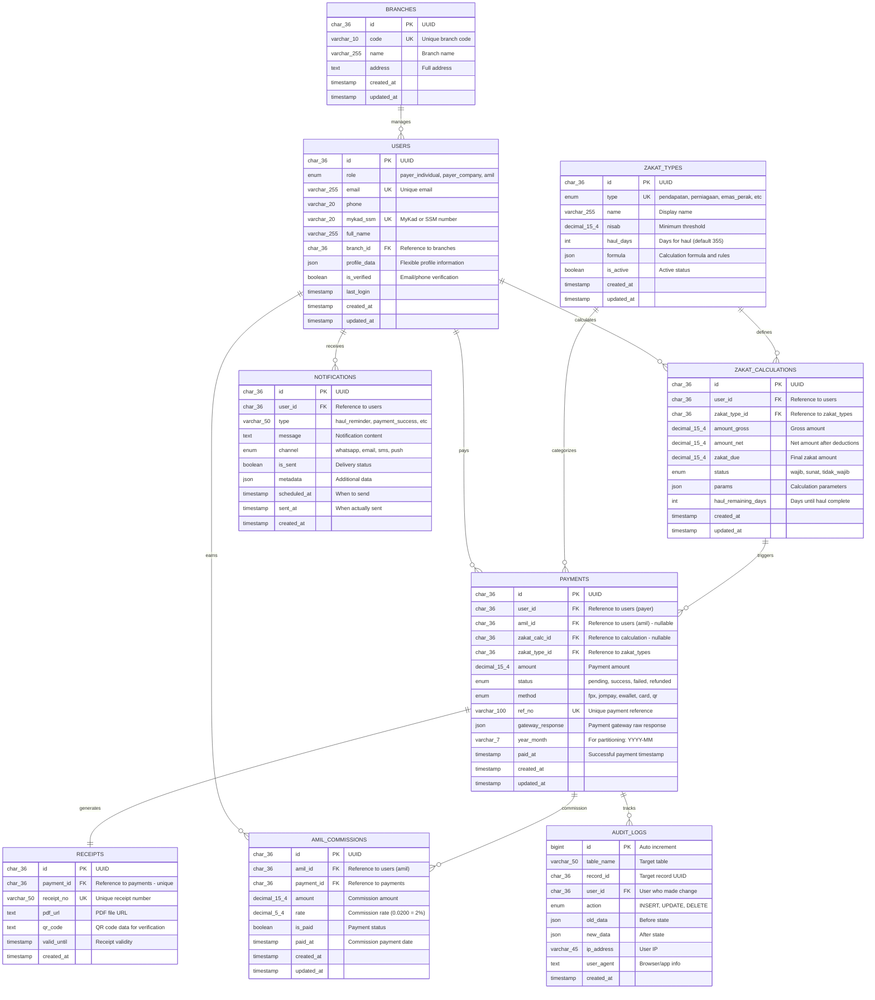

# 📊 Entity Relationship Diagram (ERD)

> **Zakat Selangor Database Schema**  
> Author: Faiz Nasir  
> Database: MySQL 8.0+

---

## Interactive ERD Diagram

Copy and paste this code into [Mermaid Live Editor](https://mermaid.live) or GitHub/Notion for interactive visualization.

---

## 🔗 Relationship Summary

| Parent Table | Child Table | Cardinality | Foreign Key | On Delete | Description |
|--------------|-------------|-------------|-------------|-----------|-------------|
| **branches** | users | 1:N | branch_id | SET NULL | Branch manages multiple users (amil/payers) |
| **users** | zakat_calculations | 1:N | user_id | CASCADE | User can have multiple zakat calculations |
| **users** | payments | 1:N | user_id | RESTRICT | User makes multiple payments (prevent deletion if payments exist) |
| **users** | payments | 1:N | amil_id | SET NULL | Amil can collect multiple payments (optional) |
| **users** | amil_commissions | 1:N | amil_id | CASCADE | Amil earns commissions from payments |
| **users** | notifications | 1:N | user_id | CASCADE | User receives multiple notifications |
| **zakat_types** | zakat_calculations | 1:N | zakat_type_id | RESTRICT | Each calculation belongs to one zakat type |
| **zakat_types** | payments | 1:N | zakat_type_id | RESTRICT | Each payment categorized by zakat type |
| **zakat_calculations** | payments | 1:N | zakat_calc_id | SET NULL | Calculation can trigger payments (optional link) |
| **payments** | receipts | 1:1 | payment_id | CASCADE | Each payment generates one receipt |
| **payments** | amil_commissions | 1:N | payment_id | CASCADE | Payment can have commission for amil |
| **payments** | audit_logs | 1:N | record_id | - | Track all payment changes |

---

## 📐 Design Principles

### 1. **Normalization**
- 3NF (Third Normal Form) compliance
- Minimal data redundancy
- Clear separation of concerns

### 2. **Performance Optimization**
- Strategic indexing on foreign keys and search columns
- Composite indexes for common query patterns
- JSON columns for flexible, non-critical data

### 3. **Data Integrity**
- UUID primary keys for security and distributed systems
- Proper foreign key constraints
- Enum types for controlled values
- NOT NULL constraints where appropriate

### 4. **Audit & Compliance**
- Complete audit trail in `audit_logs`
- Soft deletes capability via `deleted_at` (can be added)
- Timestamp tracking on all tables

### 5. **Scalability**
- Year-month partitioning on payments table
- Efficient indexes for fast queries
- JSON storage for flexible, non-relational data

---

## 🎨 Visual Guidelines

### Color Coding (for tools like dbdiagram.io)

- 🔵 **Blue**: Core entities (users, payments)
- 🟢 **Green**: Master data (branches, zakat_types)
- 🟡 **Yellow**: Transactional (zakat_calculations, receipts)
- 🟠 **Orange**: Supporting (notifications, commissions)
- 🔴 **Red**: Audit & logging

---

## 🔄 Alternative Tools

### dbdiagram.io
Visit [dbdiagram.io](https://dbdiagram.io) and use the DDL from `02-DATABASE-SCHEMA.md` to auto-generate interactive ERD.

### MySQL Workbench
Import the schema SQL file to visualize and reverse-engineer the ERD.

### Draw.io / Lucidchart
For presentation-ready diagrams with custom styling.

---

**Last Updated**: October 29, 2025  
**Author**: Faiz Nasir

