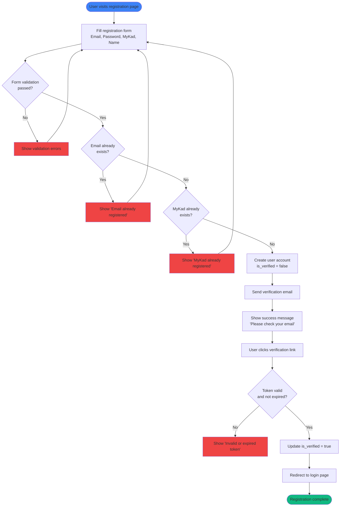
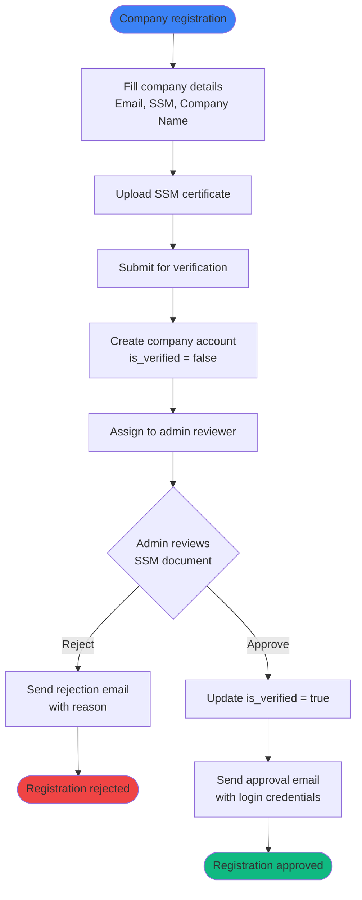
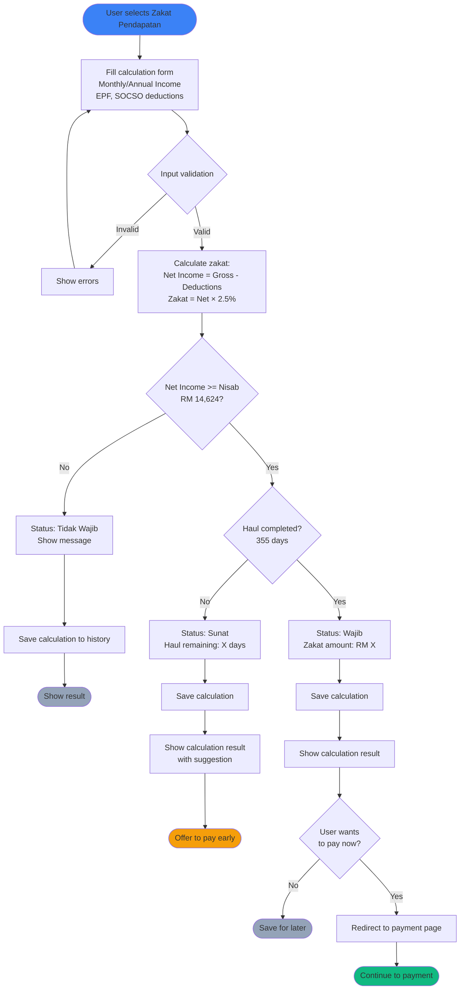
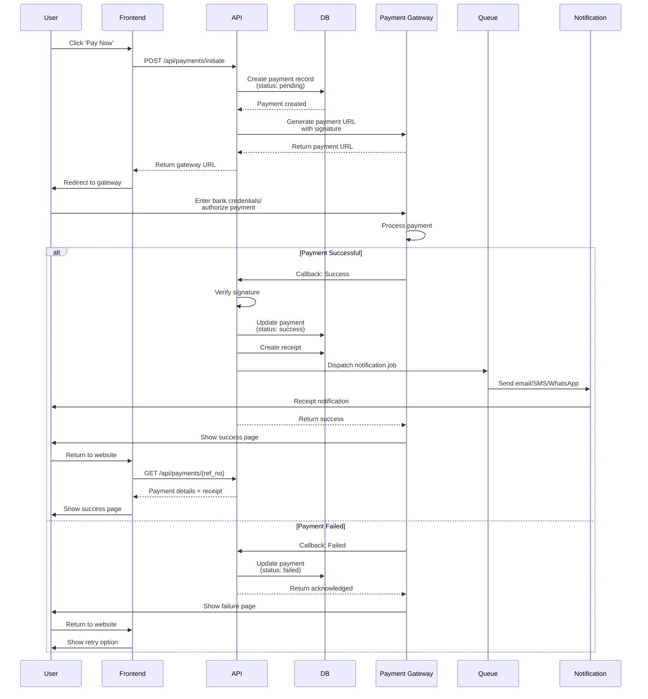
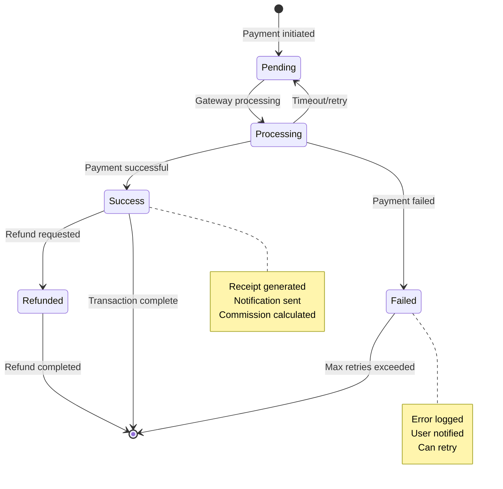
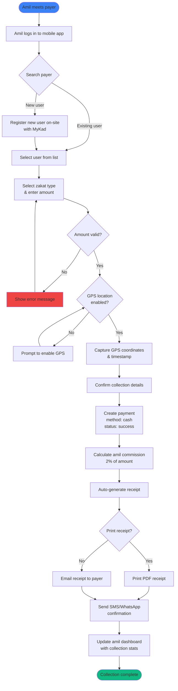
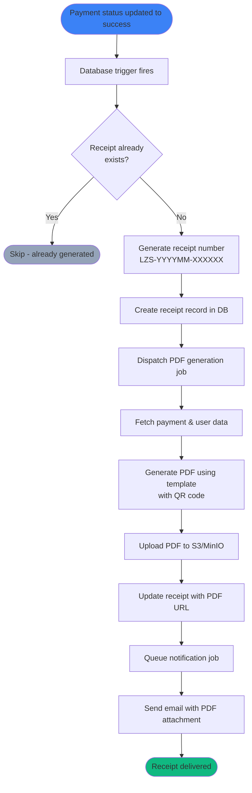
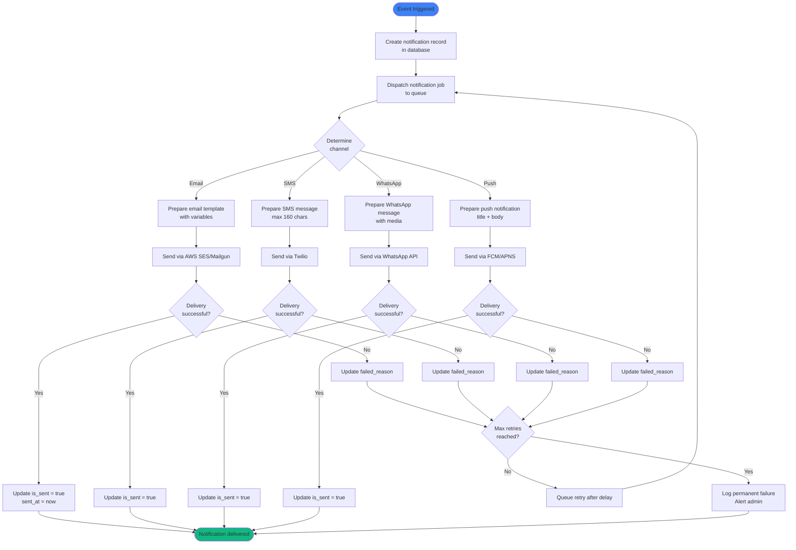
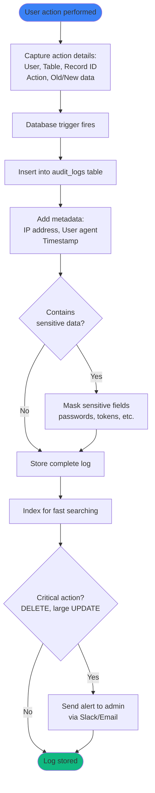

# 🔄 System Flow Diagrams

> **Zakat Selangor - Process Flow Documentation**  
> Author: Faiz Nasir  
> Version: 1.0.0

---

## 📑 Table of Contents

- [User Registration Flow](#user-registration-flow)
- [Zakat Calculation Flow](#zakat-calculation-flow)
- [Payment Processing Flow](#payment-processing-flow)
- [Amil Collection Flow](#amil-collection-flow)
- [Receipt Generation Flow](#receipt-generation-flow)
- [Notification Flow](#notification-flow)

---

## 👤 User Registration Flow

### Individual User Registration



### Corporate User Registration



---

## 🧮 Zakat Calculation Flow

### Zakat Pendapatan (Income Zakat)



---

## 💳 Payment Processing Flow

### Online Payment (FPX/eWallet)



### Payment States



---

## 👨‍💼 Amil Collection Flow

### Cash Collection by Amil



---

## 🧾 Receipt Generation Flow

### Automatic Receipt Generation



### Receipt Template Structure

```
┌─────────────────────────────────────────────────────────┐
│                 LEMBAGA ZAKAT SELANGOR                  │
│                   Official Receipt                      │
├─────────────────────────────────────────────────────────┤
│ Receipt No:  LZS-202510-001234                          │
│ Date:        29 October 2025, 10:35 AM                  │
│ Reference:   LZS-202510-001234                          │
├─────────────────────────────────────────────────────────┤
│ PAYER INFORMATION                                       │
│ Name:        Ahmad Bin Ali                              │
│ IC/SSM:      900101-01-1234                             │
│ Email:       user@example.com                           │
├─────────────────────────────────────────────────────────┤
│ PAYMENT DETAILS                                         │
│ Zakat Type:  Zakat Pendapatan                           │
│ Amount:      RM 1,305.00                                │
│ Method:      FPX (Maybank)                              │
│ Status:      Paid ✓                                     │
├─────────────────────────────────────────────────────────┤
│ Tax Deduction: This receipt can be used for income      │
│                tax deduction purposes.                  │
│                                                         │
│ [QR CODE]    Scan to verify receipt authenticity        │
│                                                         │
│ Valid until: 29 October 2035                            │
├─────────────────────────────────────────────────────────┤
│ For inquiries, contact: 03-XXXX-XXXX                    │
│ Website: www.zakat-selangor.gov.my                      │
└─────────────────────────────────────────────────────────┘
```

---

## 🔔 Notification Flow

### Multi-Channel Notification System



### Notification Triggers & Timing

| Event | Channels | Timing | Template |
|-------|----------|--------|----------|
| **Registration** | Email | Immediate | Welcome + verification link |
| **Email Verified** | Email | Immediate | Account activated |
| **Payment Success** | Email, SMS, WhatsApp | Immediate | Receipt + thank you |
| **Payment Failed** | Email, SMS | Immediate | Failure reason + retry link |
| **Haul Reminder** | WhatsApp, Email | 30 days before | "Your zakat is due soon" |
| **Ramadan Campaign** | All channels | Scheduled | Special Ramadan message |
| **Commission Paid** | Email, SMS | Immediate (amil) | Payment confirmation |
| **Receipt Generated** | Email | Immediate | PDF attachment |

---

## 🔍 Audit Trail Flow



---

**Document Version**: 1.0.0  
**Last Updated**: October 29, 2025  
**Author**: Faiz Nasir

